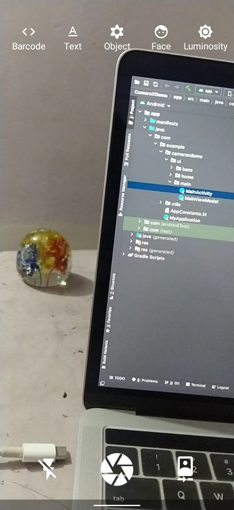
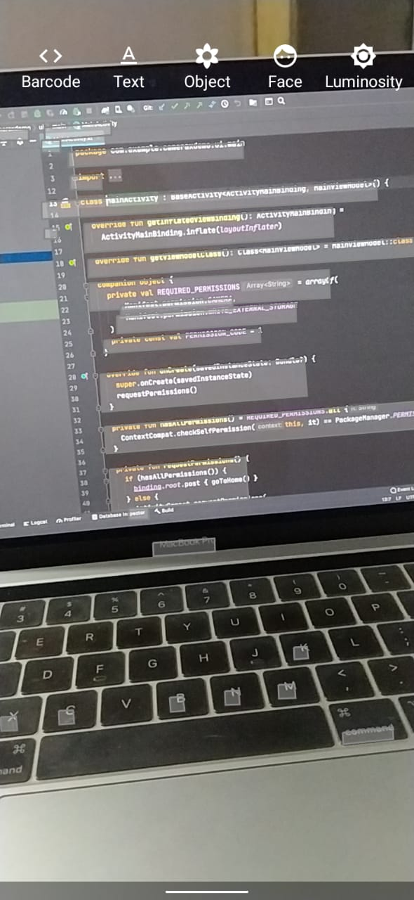
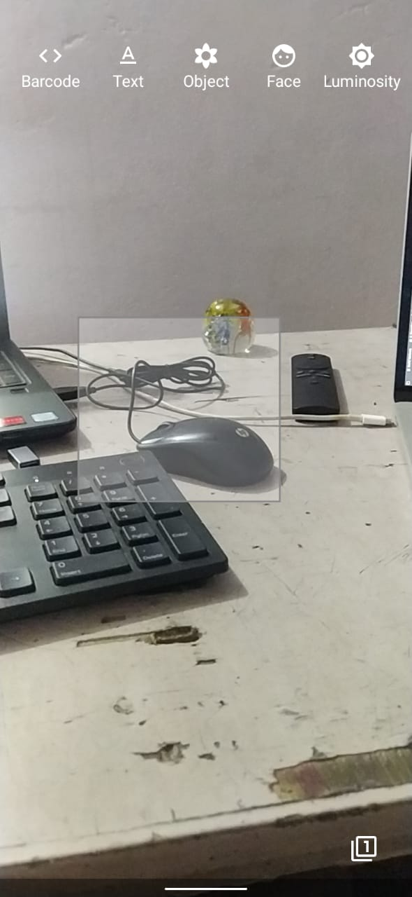
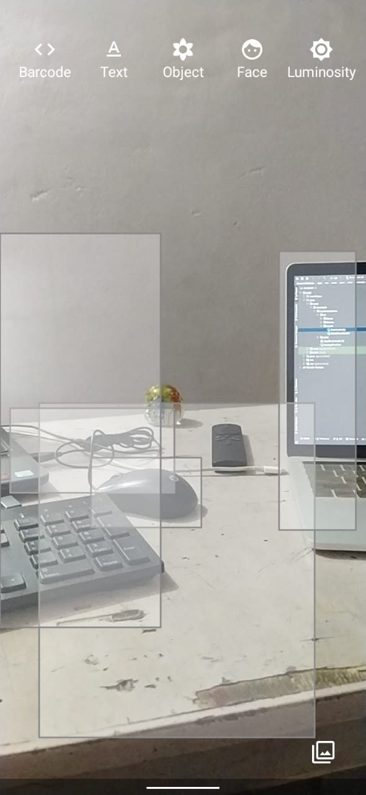

# CameraX ML Kit Demo
CameraX + ML Kit = ❤️

Using Android Jetpack CameraX API with ML Kit (previously firebase ML Kit).

### Features:
- Camera (front & back)
- Barcode Scanning
- Text Bounding
- Object Bounding & tracking (single & multiple)
- Face boulding, tracking & facial feature detection

### Preview:

#### Camera

#### Text Bounding

#### Object Bounding (single & multiple)

### Todos:
- Flash(Torch) support.
- Video support.
