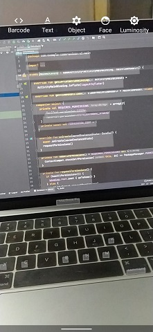

# CameraX ML Kit Demo
CameraX + ML Kit = ❤️

Basic demo app using Android Jetpack CameraX API with ML Kit (previously firebase ML Kit).

### Features:
- Camera (front & back)
- Barcode Scanning
- Text Bounding
- Object bounding & tracking (single & multiple)
- Face bounding, tracking & facial feature detection

### Preview:

#### Camera

#### Text Bounding

#### Object Bounding (single & multiple)

### Todos:
- Flash(Torch) support.
- Video support.
